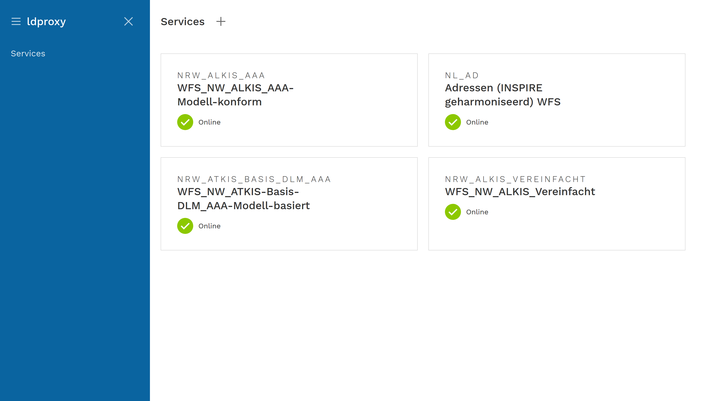

# Managing services 

ldproxy provides a web application to manage services. You will find it if you open ldproxy in your web browser for example at http://localhost:7080/ (which redirects to http://localhost:7080/manager/).

