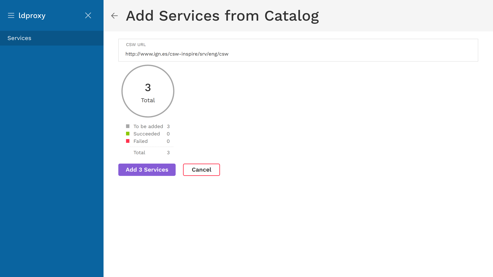
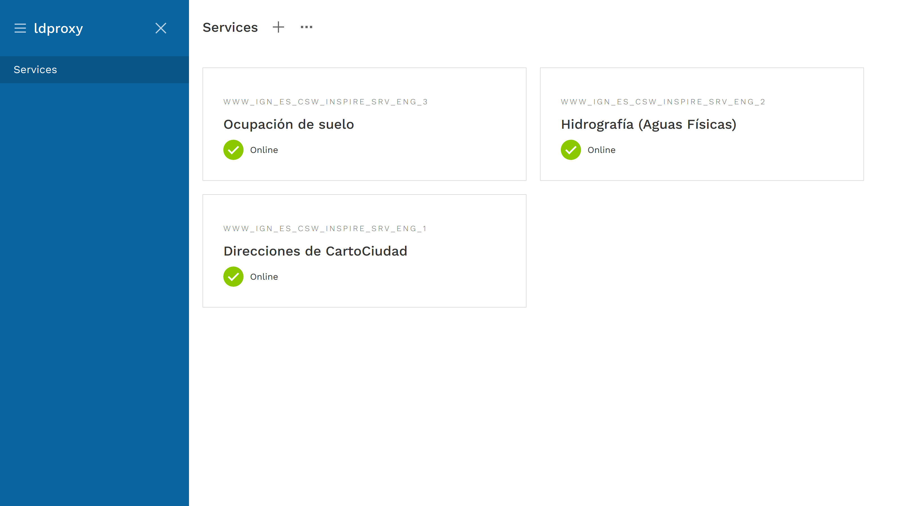

# Adding services from a catalog

ldproxy can crawl CSW catalogs to find available WFS services. To add services from a catalog, click on the three dots at the top and select ``Add from catalog``.

You are asked to enter a URL. We will use a CSW from Spain as an example: [http://www.ign.es/csw-inspire/srv/eng/csw](http://www.ign.es/csw-inspire/srv/eng/csw)

After clicking on ``Find services``, ldproxy will get the available WFS services from the catalog. Before the services are added, it will show how many were found.

After confirming to add the found services, you will see a progress chart which shows how many services were added successfully or could not be added.

If there were errors, a ``Show Errors`` button will appear. These example errors are from a different catalog.

When returning to the services overview, the added services will appear.

