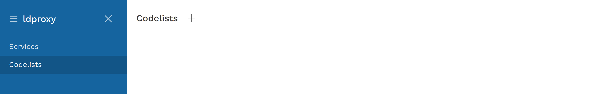
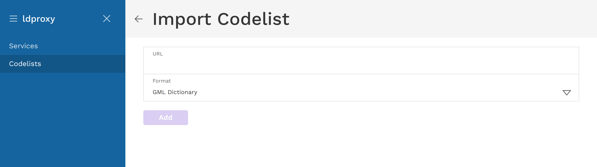
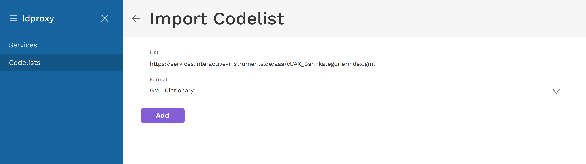
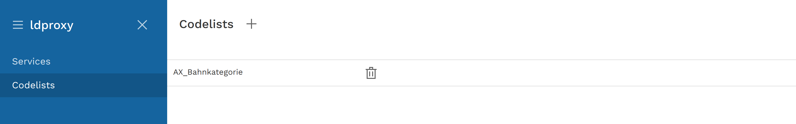
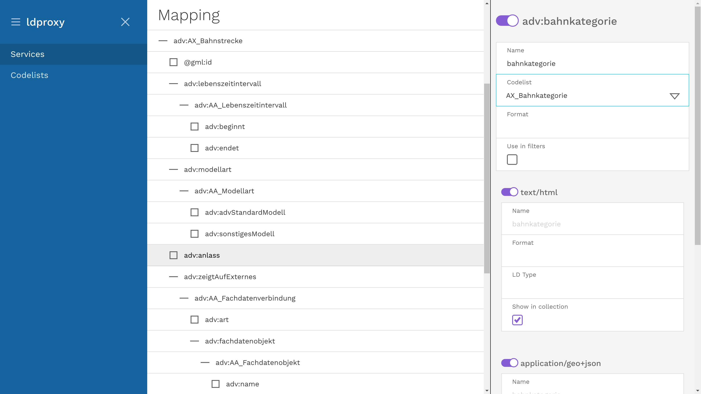

# Using codelists

Codelists can be used to resolve coded values to human readable ones. 

#### Adding a codelist

To add a codelists, choose ```Codelists``` in the menu and click on the plus sign at the top.



A dialog will appear where you can enter a codelist identifier and the URL of the codelists. For now only codelists encoded as GML dictionary are supported.



We will use a codelist from Germany as an example:

- URL: [https://services.interactive-instruments.de/aaa/cl/AX_Bahnkategorie/index.gml](https://services.interactive-instruments.de/aaa/cl/AX_Bahnkategorie/index.gml)



When you press `Add`, ldproxy will import the codelist. 



#### Using a codelist

Now you can open the feature type configuration where you want to resolve a coded value and select your codelist on the left.



