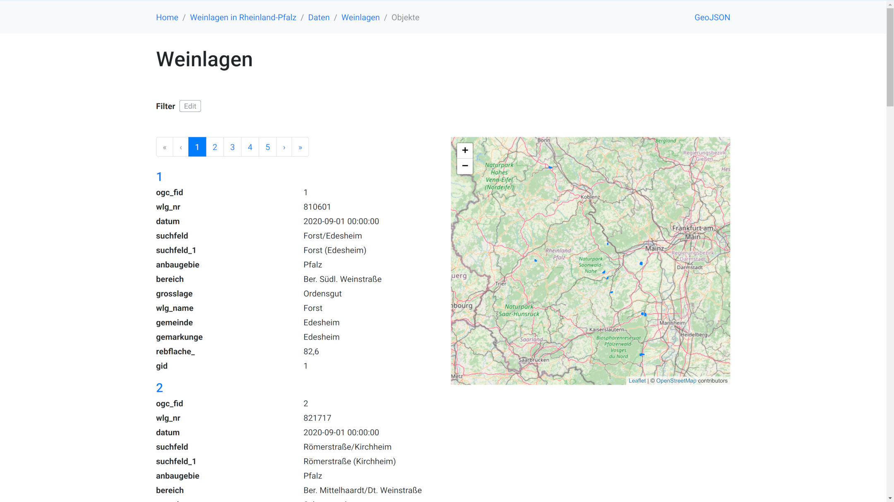

# Manager

Der Manager ist eine Web-Applikation mit deren Hilfe einfache APIs (Dienste) neu angelegt und konfiguriert werden können. 

## Einleitung

### Funktionsweise
Mit Hilfe einer webbasierten Benutzerführung wird ein neuer Dienst in nur wenigen Schritten konfiguriert und automatisch gestartet. Dazu wird nur ein Webbrowser mit Zugriff auf den Installationsserver über http benötigt. Die API kann anschließend sofort getestet und ggf. weiter angepasst werden. 

Zur Einrichtung werden zunächst einmal nur grundlegende Informationen zum [Feature-Provider](../providers) benötigt (Verbindungsdaten zu einer PostgreSQL-Datenbank oder die URL eines WFS). Weitere Angaben wie Beschreibung zur API können auch später ergänzt und geändert werden. 

Der Manager analysiert das Schema serverseitig und erzeugt aus den gewonnenen Informationen automatisch eine passende [API-Konfiguration](../services). Der Vorgang nimmt typischerweise - je nach Größe des Schemas - wenige Sekunden bis mehrere Minuten in Anspruch. 

Zur Unterstützung bei der Einrichtung eines Dienstes liefern Tooltips in den Formularen Beschreibungen, Erläuterungen und Hinweise zu den entsprechenden Konfigurationseigenschaften.

Die einzelnen Formulare sind weiter unten beschrieben.

### Einsatzzweck
**Wofür eigenet sich der Manager**: 
Der Manager kann zur Erstkonfiguration sowie zur Anpassung einfacher (zuvor auch mit dem Manager erstellten) APIs eingesetzt werden. Der typische Anwendungsfall ist die Erstellung einer Konfiguration durch einen Fachadministrator für einfache Datenbankschemata mit "ShapeFile-Komplexlität" (das beudetet mit wenigen Tabellen, keine Tabellenbeziehungen, eine Geometriespalte pro Tabelle). Der Einsatzort ist in der Regel ein Test-/Entwicklungs- oder Authoring-System. Die generierte Konfiguration erzeugt eine lauffähige API. Dabei können Daten- und Umgebungs-spezifische Angaben zu den Defaults der API, Auswahl der API-Module, Beschreibungen und Metainformationen konfiguriert werden.

**Wofür ist der Manager nicht gedacht**: Die Erstellung oder Bearbeitung von Konfigurationen für komplexe Schemata oder eine vollständige Konfiguration im vollen Umfang aller in der Software unterstützten Konfigurationseigenschaften. Genausowenig eigenet sich der Manager zur Bearbeitung von bestehenden Konfigurationen, die nicht über den Manager erzeugt wurden.

### Hinweise zum Funktionsumfang
Voraussetzungen:
* Die Software ist auf dem Server , erfolgreich gestartet und über http erreichbar (unter dem konfigurierten [Port](../global-configuration.md#port)). 
* Im Webbrowser (mit dem der Manager bedient wird) ist JavaScript aktiviert und Cookies sind erlaubt. 

Hinweise zum Funktionsumfang:
* Als Backend werden derzeit PostgreSQL-Datenbank mit PostGIS sowie WFS unterstützt (siehe [Feature-Provider](../configuration/providers)).
* Ein direkter Zugriff auf den Server ist empfohlen und teilweise sogar erforderlich (Sichtung Logdatei, nachträgliche Anpassung von Datenbankparametern).  
* Bei großen und komplexen Schemata und großen Datenmengen kann die Erstellung der Konfiguration sowie Änderung der Parameter zu langen Wartezeiten führen. 
  * Bei großen Schemata mit vielen Tabellen kann als Abhilfe die Menge der Tabellen beim Aufsetzen des Dienstes aus SQL-Datenbank mit dem Tabellenfilter auf den benötigten (kleineren) Umfang eingeschränkt werden. Beziehen sich die Angaben im Tabellenfilter auf Views, so werden durch den automatischen Konfigurationsschritt auch die zugrunde liegenden Tabellen ausgewählt und unter Collections angezeigt.
* Komplexe Abbildungen mit Joins sowie Filterung (Prädikate) auf Datenbanktabellen (SQL-Provider) sind nur manuell in YAML-Konfiguration möglich.
* Einmal im Manager konfigurierte Werte für den Provider (insbesondere die Datenbankparameter) können später nur noch in YAML-Datei geändert werden. Beim Service sind auch nicht alle Parameter über den Manager steuerbar.
* Manuelle Änderungen in den YAML-Dateien sollten nur in folgenden Ausnamefällen erfolgen:
  * Man möchte danach den Manager nicht mehr verwenden (ab jetzt nur noch Bearbeitung direkt von YAML-Dateien).
  * Anpassung von Datenbankeinstellungen in dem Provider. 
  * Anpassung von Beschreibungen im Provider (`description`). Es dürfen dabei keine Schema-Informationen geändert werden, die bereits in der API-Konfiguration (services) verwendet werden.  
* Die Funktionalität der Konfiguration über `overrides` und `additionalLocations` werden nicht unterstützt.
* Das Passwort für SQL-Datenbank wird als Base64-kodiert erwartet. Falls es nicht schon so vorliegt, kann ein Text z.B. unter Linux wie folgt kodiert werden: `echo -n "Passwort" | base64`
* Bei der automatischen Konfiguration von Datenbank-Views können Id-Spalten nicht immer korrekt erkannt und konfiguriert werden. Bei Bedarf muss die Angaben `role: ID` sowie `sourcePathDefaults`  in der erzeugten YAML-Datei (unter `store/entitites/providers`) manuell ergänzt werden.
* Grundsätzlich werden alle Provider-spezifischen Parameter nur einmal beim Einrichten des Dienstes vorgegeben bzw. auf Standardwerte gesetzt und können danach nur  in den erzeugten YAML-Dateien manuell geändert werden (z.B. Name der Datenbank, Host der Datenbank, Passwort, Einstellungen zum Datenbank-Verbindungs-Pool, usw.). Dies betrifft praktisch alle Parameter im Provider. 
* Wird das native CRS bei der automatischen Konfiguration nicht wie erwartet ermittelt, kann der Wert nachträglich in der YAML-Datei manuell angepasst werden.

## Globale Konfiguration und erster Aufruf
Der Manager ist standardmäßig aktiviert und unter `/manager/` erreichbar, kann aber in der [globalen Konfiguration](../global-configuration.md#manager) deaktiviert werden. 

Die erste Anmeldung am Manager erfolgt mit Benutzer `admin` und Passwort `admin`, es folgt dann eine Aufforderung, das Passwort anzupassen. 

Nach der Anmeldung befindet man sich in der Übersicht der Dienste.

## Defaults anpassen

Der Manager erlaubt es die Defaults, die für alle Dienste gelten sollen, anzupassen. Dazu muss man in der Übersicht der Dienste oben rechts auf das Zahnrad klicken. Der Screenshot zeigt beispielhaft die Anpassung der Kontaktinformationen.

## Dienste anlegen

Um einen neuen Dienst anzulegen, muss man in der Übersicht der Dienste oben rechts auf das Plus klicken. Es öffnet sich dann ein Formular zur Konfiguration der Datenquelle. Als Beispiel verwenden wir hier den [Demo-Dienst mit Weinlagen in Rheinland-Pfalz](https://demo.ldproxy.net/vineyards), die Daten und eine Anleitung zum Anlegen ohne Manager finden sich [hier](https://github.com/interactive-instruments/ldproxy/tree/master/demo/vineyards).

Danach öffnet sich automatisch wieder die Übersicht der Dienste mit dem neuen Dienst.

## Dienste nutzen

Ein Klick auf den Dienst öffnet die Detailansicht des Dienstes.

Die Symbole oben rechts erlauben es, einen Dienst zu stoppen oder wieder zu starten, einen Dienst zu löschen sowie die Startseite des Dienstes zu öffnen.

## Dienste anpassen

Die Detailansicht des Dienstes erlaubt es auch die Konfiguration des Dienstes anzupassen. Zunächst ändern wir die Beschreibung des Dienstes:

Dann ergänzen wir Angaben zur Lizenz im Metadaten-Tab. Hier sehen wir auch unsere zu Anfang in den Defaults ergänzten Angaben der Kontaktdaten:

Anschließend ändern wir noch die Bezeichnung der Collection nach einem Klick auf `vineyards` im Collections-Tab.

Die durchgeführten Änderungen zeigen sich bei einem erneuten Öffnen der Startseite:

Als nächstes passen wir noch die HTML-Ausgabe der Features an. Durch Klicks auf der Startseite auf den Link `Zu den Daten` und anschließend auf `Weinlagen` öffnet sich die Features-Ansicht.

Wir öffnen jetzt im Manager in der Collection-Ansicht den Daten-Tab, klicken dort zunächst auf `ogc_fid` und später `gid`, scrollen jeweils rechts nach unten zu `Features HTML` und deaktivieren den Schalter für `Aktiviert`.

Die Änderungen zeigen sich nach einer Aktualisierung der Features-Ansicht.

