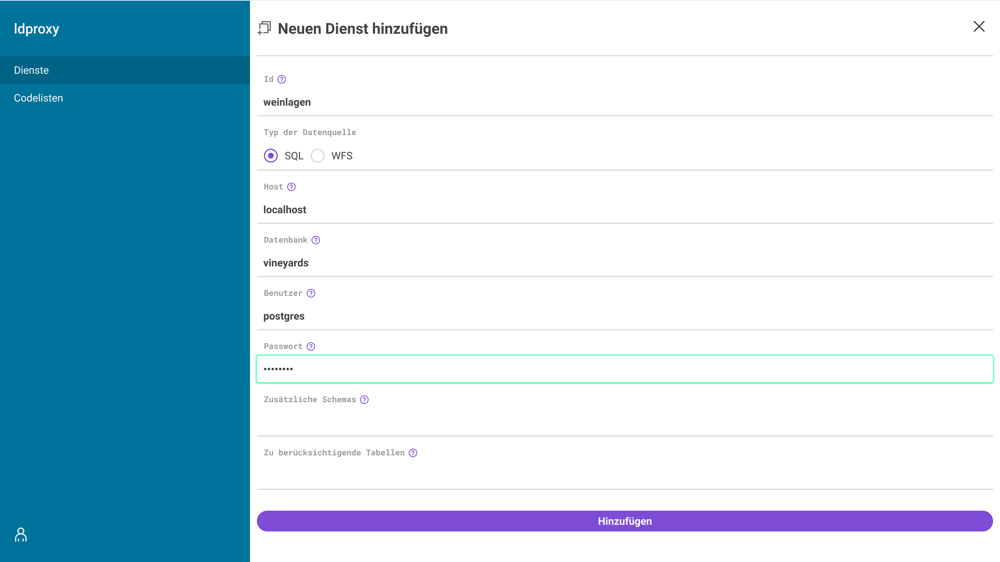

# Manager

Der Manager ist eine Web-Applikation, die es erlaubt einfache APIs (Dienste) neu anzulegen und deren Konfiguration anzupassen. Der Manager ist standardmäßig aktiviert, kann aber in der [globalen Konfiguration](../global-configuration.md#manager) deaktiviert werden.

Die erste Anmeldung am Manager erfolgt mit Benutzer `admin` und Password `admin`, es folgt dann eine Aufforderung, das Password anzupassen.

Nach der Anmeldung befindet man sich in der Übersicht der Dienste.

## Defaults anpassen

Der Manager erlaubt es die Defaults, die für alle Dienste gelten sollen, anzupassen. Dazu muss man in der Übersicht der Dienste oben rechts auf das Zahnrad klicken. Der Screenshot zeigt beispielhaft die Anpassung der Kontaktinformationen.

## Dienste anlegen

Um einen neuen Dienst anzulegen, muss man in der Übersicht der Dienste oben rechts auf das Plus klicken. Es öffnet sich dann ein Formular zur Konfiguration der Datenquelle. Als Beispiel verwenden wir hier den [Demo-Dienst mit Weinlagen in Rheinland-Pfalz](https://demo.ldproxy.net/vineyards), die Daten und eine Anleitung zum Anlegen ohne Manager finden sich [hier](https://github.com/interactive-instruments/ldproxy/tree/master/demo/vineyards).

Danach öffnet sich automatisch wieder die Übersicht der Dienste mit dem neuen Dienst.

## Dienste nutzen

Ein Klick auf den Dienst öffnet die Detailansicht des Dienstes.

Die Symbole oben rechts erlauben es, einen Dienst zu stoppen oder wieder zu starten, einen Dienst zu löschen sowie die Startseite des Dienstes zu öffnen.

## Dienste anpassen

Die Detailansicht des Dienstes erlaubt es auch die Konfiguration des Dienstes anzupassen. Zunächst ändern wir die Beschreibung des Dienstes:

Dann ergänzen wir Angaben zur Lizenz im Metadaten-Tab. Hier sehen wir auch unsere zu Anfang in den Defaults ergänzten Angaben der Kontaktdaten:

Anschließend ändern wir noch die Bezeichnung der Collection nach einem Klick auf `vineyards` im Collections-Tab.

Die durchgeführten Änderungen zeigen sich bei einem erneuten Öffnen der Startseite:

Als nächstes passen wir noch die HTML-Ausgabe der Features an. Durch Klicks auf der Startseite auf den Link `Zu den Daten` und anschließend auf `Weinlagen` öffnet sich die Features-Ansicht.

Wir öffnen jetzt im Manager in der Collection-Ansicht den Daten-Tab, klicken dort zunächst auf `ogc_fid` und später `gid`, scrollen jeweils rechts nach unten zu `Features HTML` und deaktivieren den Schalter für `Aktiviert`.

Die Änderungen zeigen sich nach einer Aktualisierung der Features-Ansicht.

