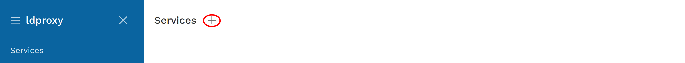
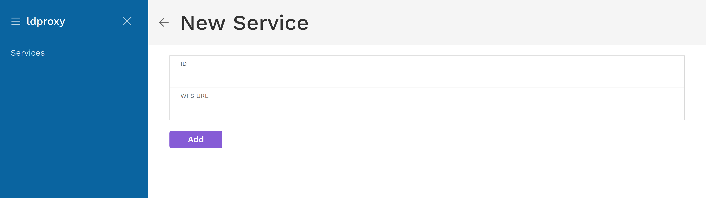
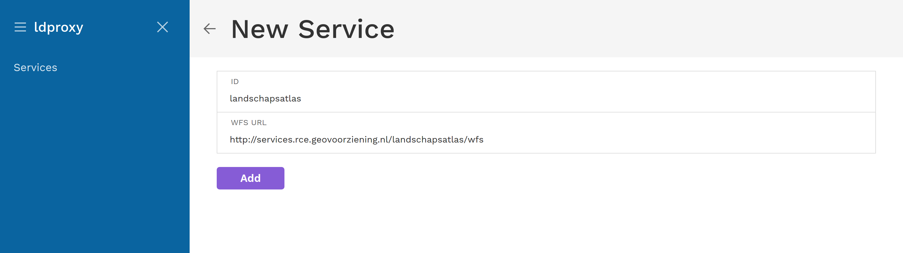
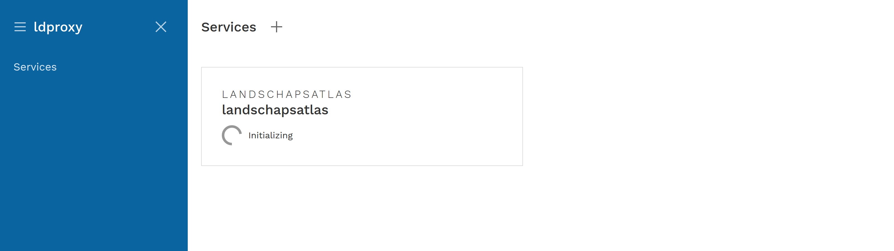
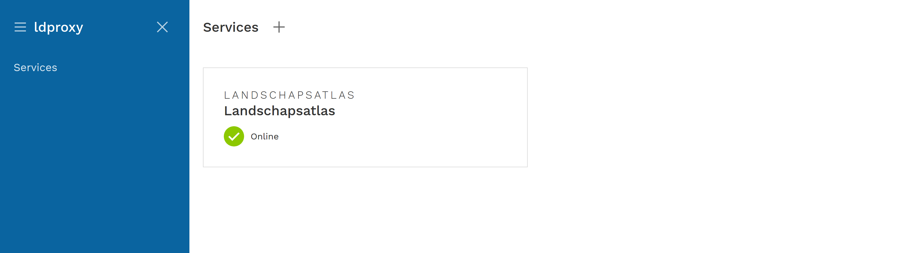
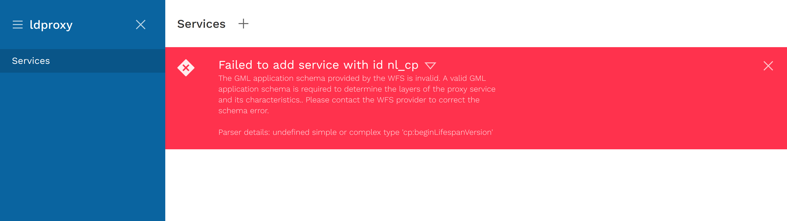
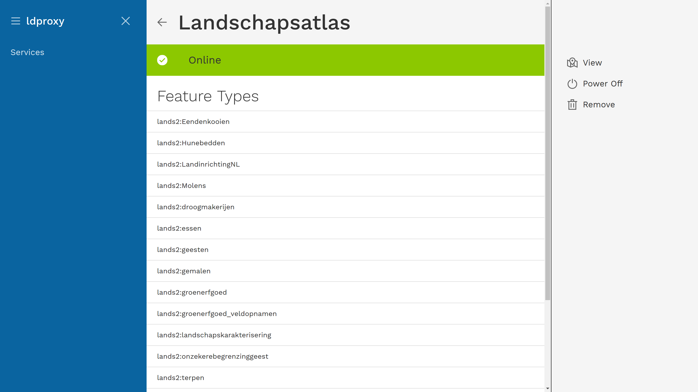
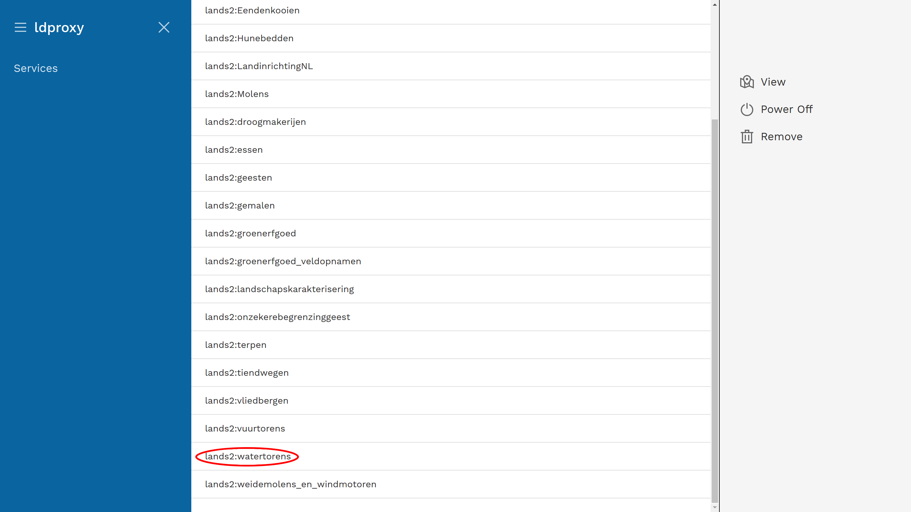
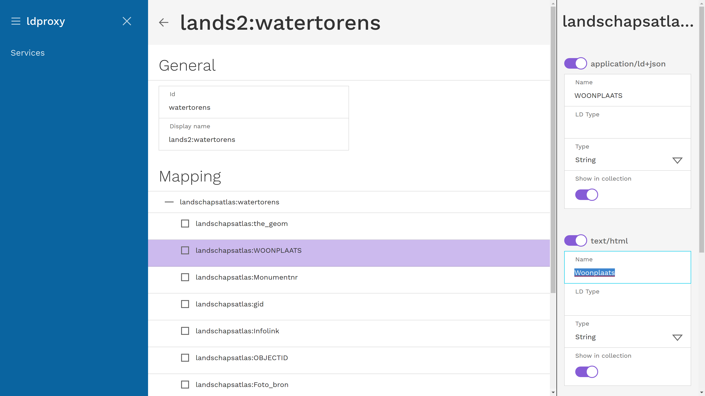

# Managing services 

ldproxy provides a web application to manage services. You will find it if you open ldproxy in your web browser for example at http://localhost:7080/ (which redirects to http://localhost:7080/manager/).

## Adding a service

To add a proxy service for a WFS, click on the plus sign at the top.

A dialog will appear where you can enter a service identifier and the URL of the WFS.

We will use a WFS from the Netherlands as an example:

- ID: landschapsatlas
- WFS URL: [http://services.rce.geovoorziening.nl/landschapsatlas/wfs](http://services.rce.geovoorziening.nl/landschapsatlas/wfs?service=WFS&request=GetCapabilities)

When you press `Add`, ldproxy will analyze the WFS and configure the proxy service. 

Once the service is configured, it will switch its state from `Initializing` to `Online`.

If an issue with the service is identified, a message appears. Clicking on the arrow shows the details why a service cannot be created. A typical issue are invalid or missing schemas.

If you click on the service in the service list, the detail view will be opened.

To start browsing the proxy service, click on `View` at the right. That will lead to the main page, which is generated from the WFS capabilities document.

## Changing the service configuration

Using the ldproxy manager you can also change the configuration of proxy services. Here we will explain a few typical changes that are often helpful to improve how the feature data is displayed in the HTML pages.

#### Change the label used to display a feature type to a more human friendly name

For example, let's change `lands2:watertorens` to `Watertorens`. 

In the detail view for the service, click on `lands2:watertorens` at the bottom.

This will open the detail view for the feature type. Change the  `Display name` from `lands2:watertorens` to `Watertorens`.

#### Change the label used to display a property of a feature type to a more human friendly name

For example, change `WOONPLAATS` to `Woonplats`.

In the detail view for the feature type, click on `landschapsatlas:WOONPLATS`. This will open the mapping configuration for the property on the right.

Change the  `Name` under `text/html` from `WOONPLAATS` to `Woonplats`.

#### Remove an attribute from the overview pages

For example, disable that `Foto_groot` is shown in the overviews.

In the detail view for the feature type, click on `landschapsatlas:Foto_groot`. This will open the mapping configuration for the property on the right.

Disable the switch for `Show in collection` under `text/html`.

#### Suppress an attribute everywhere

For example, disable that `OBJECTID` is shown in the overviews and the page of each feature.

In the detail view for the feature type, click on `landschapsatlas:OBJECTID`. This will open the mapping configuration for the property on the right.

Disable the switch for `text/html`.

#### Change the label of a feature to a more useful name

By default, the label will use the `gml:id` of the feature as an identifier, which in many cases will be of no use for a user.

For example `watertorens.1` will not be a useful name for a user. A better fit would be the name of the municipality.

In the detail view for the feature type, click on `landschapsatlas:watertorens`. This will open the mapping configuration for the feature type on the right.

Change the  `Name` under `text/html` from `{{id}}` to `{{Woonplats}}`.

