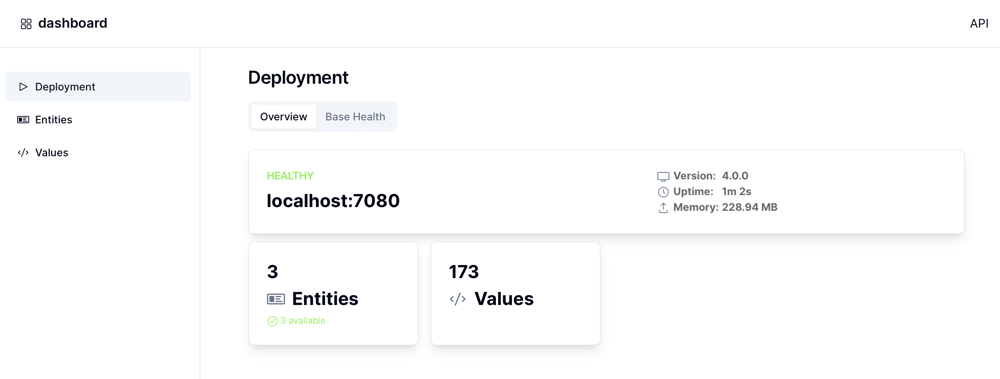

# Dashboard

Das Operations-Dashboard bietet einen Einblick in den aktuellen Status des Deployments und kann bei der Analyse unterstützen, wenn Probleme auftreten. 

Es läuft auf Port `7081`, es kann also z.B. unter http://localhost:7081 im Browser geöffnet werden. 
Eine OpenAPI-Definition der vom Dashboard verwendeten API ist unter http://localhost:7081/api zu finden, diese bietet noch tiefere Einblicke.

