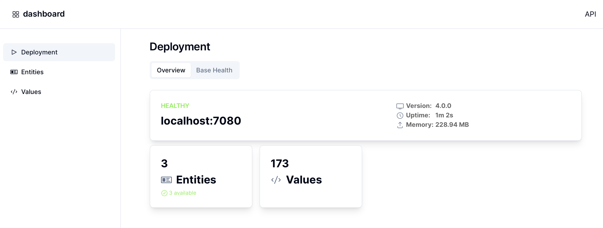

# Dashboard

The operations dashboard provides an overview of the current status of the deployment and can be helpful when analyzing problems. 

It is available on port `7081`, so it can be accessed for example by opening http://localhost:7081 in the browser.
An OpenAPI definition for the API used by the dashboard is available at http://localhost:7081/api, it provides deeper insights.

